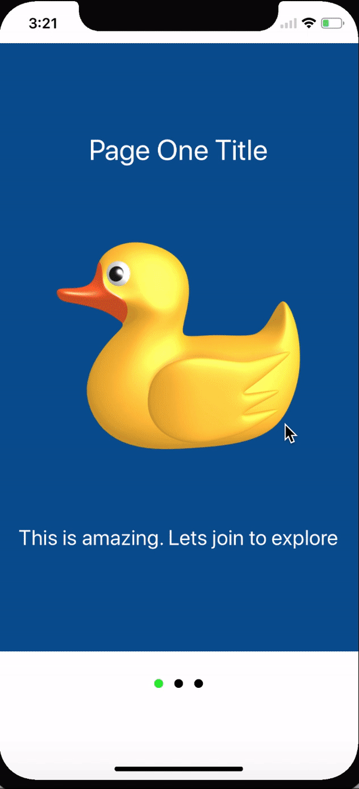

# OnboardPagesSwift

Onboard Pages using Storyboard and Swift 4.

# Swift 4
# Xcode 9

 You can customize your page in Xib file.  
You can create separate XIb files for different pages. 
Easy to use and configure. Customzie using Interface builder quickly as per your need.

